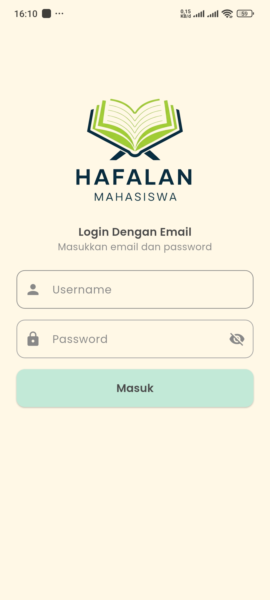
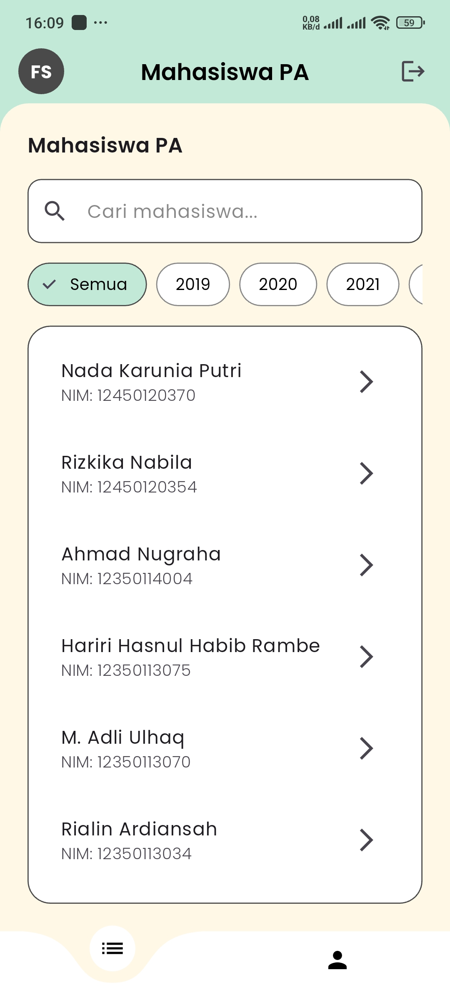
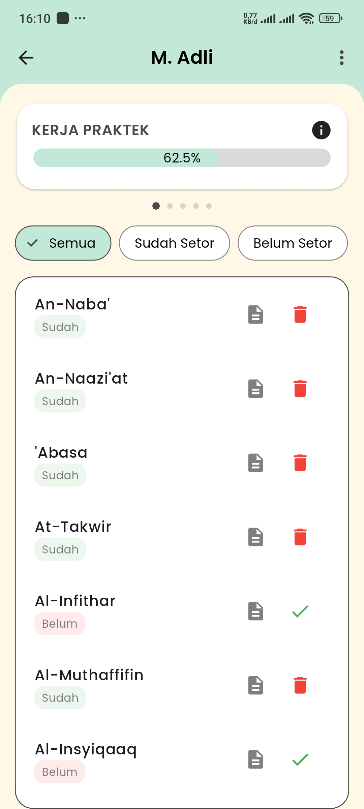
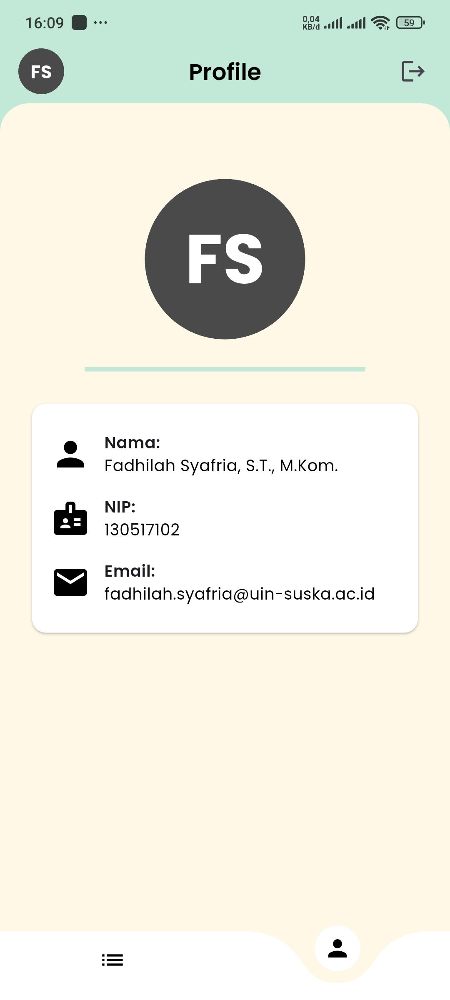

# HAFALAN MAHASISWA for Dosen


## Deskripsi

**Hafalyuk Dosen** adalah aplikasi mobile berbasis Flutter yang dirancang khusus untuk membantu dosen pembimbing akademik (PA) dalam mengelola data setoran mahasiswa Teknik Informatika UIN SUSKA RIAU, memantau progres akademik, dan memantau profil mahasiswa. Aplikasi ini dilengkapi dengan sistem autentikasi aman berbasis Keycloak dan desain antarmuka modern yang user-friendly dengan Google Fonts dan animasi transisi yang halus.

---

## Fitur Utama

### 🔒 Autentikasi Aman

* Login dengan username dan password melalui Keycloak.
* Manajemen token dengan refresh token otomatis.
* Logout otomatis setelah 10 menit tidak aktif.
* Validasi peran untuk memastikan akses khusus dosen.

### 👨‍🎓 Manajemen Data Mahasiswa

* Daftar mahasiswa berdasarkan tahun angkatan dan pencarian nama.
* Filter mahasiswa per angkatan (2019-2024 atau semua).
* Pencarian real-time menggunakan input teks.

### 📄 Manajemen Setoran Mahasiswa

* Detail setoran per mahasiswa (status: Sudah Setor atau Belum Setor).
* Filter setoran berdasarkan status.
* Validasi atau pembatalan setoran (individu/multi-select).
* Ringkasan progres akademik dalam carousel (KP, Seminar KP, TA, Sempro, Sidang TA).

### 👤 Profil Dosen

* Menampilkan nama, NIP, dan email dosen.
* Avatar personalisasi berdasarkan inisial nama.

### 🌈 Desain dan Pengalaman Pengguna

* Tema warna: kuning pastel, hijau sage, abu-abu.
* Animasi transisi halus dengan PageRouteBuilder.
* Bottom navigation bar melengkung dengan curved\_navigation\_bar.
* Bottom sheet untuk detail setoran dan informasi mahasiswa.
* Notifikasi dengan ScaffoldMessenger untuk feedback pengguna.

### 📡️ Manajemen Koneksi

* Penanganan error koneksi dengan notifikasi dan tombol refresh.
* Validasi token untuk menjaga sesi pengguna.

---

## Struktur Proyek

```
lib/
├── models/
│   ├── pa_model.dart
│   ├── setoran_model.dart
│   └── login_model.dart
├── pages/
│   ├── login_page.dart
│   ├── pa_page.dart
│   ├── mahasiswa_page.dart
│   ├── setoran_detail_page.dart
│   └── dosen_profile_page.dart
├── services/
│   ├── auth_service.dart
│   └── pa_service.dart
├── widgets/
│   ├── info_item_widget.dart
│   ├── detail_bottom_sheet.dart
│   ├── student_info_bottom_sheet.dart
│   ├── progress_bottom_sheet.dart
│   ├── progress_card.dart
│   ├── toggle_confirmation_dialog.dart
│   └── logout_alert.dart
```

---

## Dependensi Utama

* `dio`: HTTP client.
* `flutter_secure_storage`: Penyimpanan token aman.
* `flutter_dotenv`: Manajemen konfigurasi environment.
* `google_fonts`: Menggunakan font Poppins.
* `curved_navigation_bar`: Bottom navigation bar melengkung.
* `carousel_slider`: Carousel progres akademik.
* `percent_indicator`: Indikator progres (opsional).
* `jwt_decoder`: Dekode dan validasi token JWT.
* `flutter_launcher_icons`: Konfigurasi ikon aplikasi.

---

## Konfigurasi

### File .env

Contoh konfigurasi:

```
URL_API=<API_URL>
BASE_URL=<BASE_URL>
KC_URL=<KEYCLOAK_URL>
CLIENT_ID=<KEYCLOAK_CLIENT_ID>
CLIENT_SECRET=<KEYCLOAK_CLIENT_SECRET>
```

### Ikon dan Font

* Ikon aplikasi: `assets/images/logoApp.png`
* Font: Poppins dari `assets/fonts/Poppins-Medium.ttf`

---

## Cara Menjalankan

### Prasyarat

* Flutter SDK
* Emulator atau perangkat fisik

### Langkah-langkah

```bash
# Kloning repositori
git clone https://github.com/BgApii/hafalyuk_dsn.git
cd hafalyuk_dsn

# Instal dependensi
flutter pub get

# Buat file .env dan isi konfigurasi

# Jalankan aplikasi
flutter run
```


## Screenshot

<p align="center">
  
  
  
  
</p>

---

## Catatan Pengembangan

* Penanganan error koneksi dan token kadaluarsa.
* Token aman dengan `flutter_secure_storage` dan auto-refresh.
* Optimasi performa scrolling.
* UI konsisten dengan warna, font, dan animasi.

---

## Kontak

Untuk pertanyaan atau dukungan, silakan hubungi: `aprissupandi@gmail.com`
